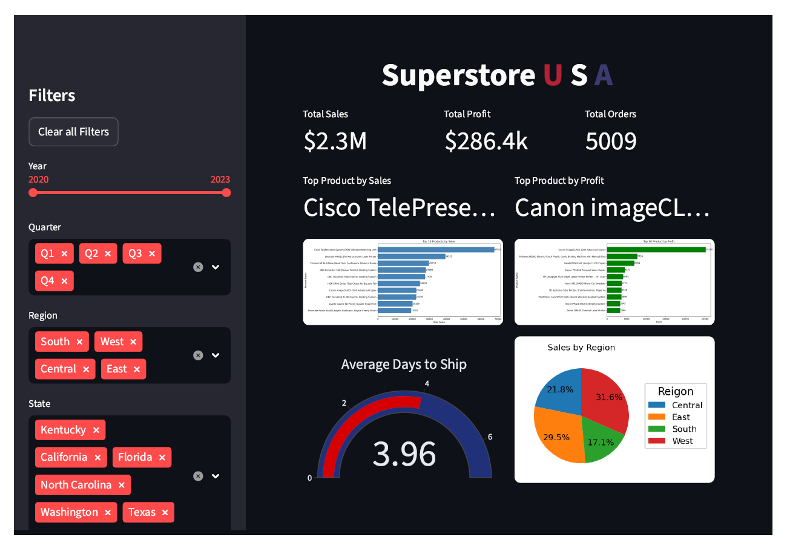
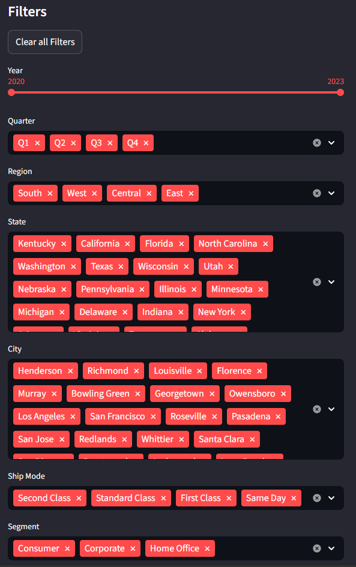
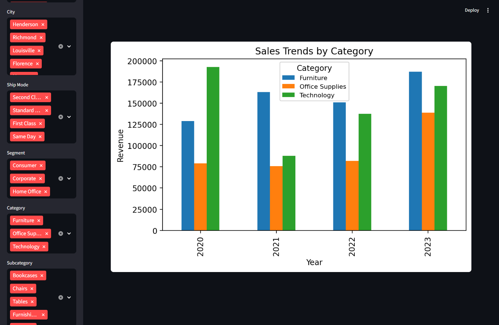

# 📊 Superstore USA – Data Visualization Dashboard

An interactive, production-style Streamlit dashboard built on the Superstore dataset,
focused on data cleaning, advanced filtering, and insightful business visualizations.

## 🚀 Features

- End-to-end data cleaning with Pandas
- Dynamic sidebar filters with session state handling
- Multi-level filtering (Year, Quarter, Region, State, City, Category, Subcategory, Segment, Ship Mode)
- Key business KPIs (Sales, Profit, Orders)
- Interactive and static visualizations
- Responsive wide-layout dashboard

## 📈 Visualizations

- KPI cards:
  - Total Sales
  - Total Profit
  - Total Orders

- Top 10 Products:
  - By Sales (horizontal bar chart)
  - By Profit (horizontal bar chart)

- Sales Distribution:
  - Sales by Region (pie chart)

- Shipping Performance:
  - Average Days to Ship (gauge chart)

- Sales Trends:
  - Yearly revenue trends by Category (grouped bar chart)

## 🛠 Tech Stack

- Python
- Streamlit
- Pandas
- Matplotlib
- Plotly
- Millify

## 🧹 Data Processing

- Date parsing and transformation
- Feature engineering:
  - Year extraction
  - Quarter calculation
  - Delivery time (Days to Ship)
- Data normalization:
  - Missing postal codes handling
  - Numeric rounding
  - Column renaming for clarity
- Derived metrics:
  - Revenue calculation
  - Aggregated KPIs

## 💡 Why this project?

Built to practice and demonstrate:
- real-world data cleaning workflows
- complex Streamlit sidebar filtering logic
- session state management
- business-oriented data visualization
- combining Matplotlib and Plotly in one dashboard
- transforming raw transactional data into insights

This project serves as a strong foundation for:
- business intelligence dashboards
- sales analytics
- data analyst portfolio projects

## 📸 Screenshots

### 📊 Main Dashboard

### 🔎 Advanced Filters

### 📈 Interactive Charts

---

(No sensitive or confidential data is included in this repository.
The dataset is used strictly for educational and portfolio purposes.)

